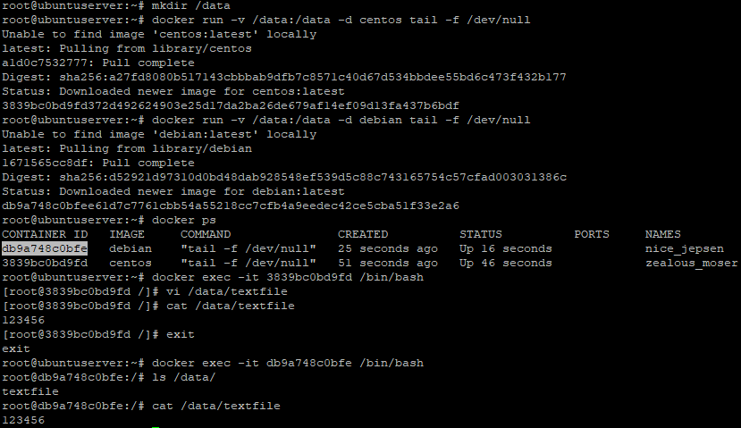

# Домашнее задание к занятию "5.3. Введение. Экосистема. Архитектура. Жизненный цикл Docker контейнера"
1. Ссылка на Docker образ Nginx: https://hub.docker.com/r/pavelorlov1/netology-nginx
2. По сценариям:  
   сценарий | мой выбор
   -------- | ---------
   Высоконагруженное монолитное java веб-приложение | Логичнее использовать физическую машину чтобы не добавлять лишних уровней абстракции.
   Nodejs веб-приложение | Вополне подходит docker, будет проще с развёртыванием и дублированием.
   Мобильное приложение c версиями для Android и iOS | Если имеется в виду серверная часть приложения, то вполне можно использовать docker с теми же основаниями что и предыдущий сценарий.
   Шина данных на базе Apache Kafka | Можно использовать как docker так и виртуальную машину.
   Elasticsearch кластер для реализации логирования продуктивного веб-приложения - три ноды elasticsearch, два logstash и две ноды kibana | Можно использовать как docker контейнеры на разных хостах так и виртуальные машины. docker контейнеры будут проще в развёртывании и дублировании.
   Мониторинг-стек на базе Prometheus и Grafana | Я бы выбрал docker контейнеры в связи с простотой развёртывани и дублирования.
   MongoDB, как основное хранилище данных для java-приложения | Я бы выбрал виртуальные или физические машины чтобы не создавать лишних уровней абстракций.
   Gitlab сервер для реализации CI/CD процессов и приватный (закрытый) Docker Registry. | Можно использовать Docker контейнер или виртуальную машину. Docker контейнер был бы проще с точки зрения развёртывания.
3. Терминал во время выполнения задачи:  
     
4. Ссылка на Docker образ Ansible: https://hub.docker.com/r/pavelorlov1/netology-ansible-5.3